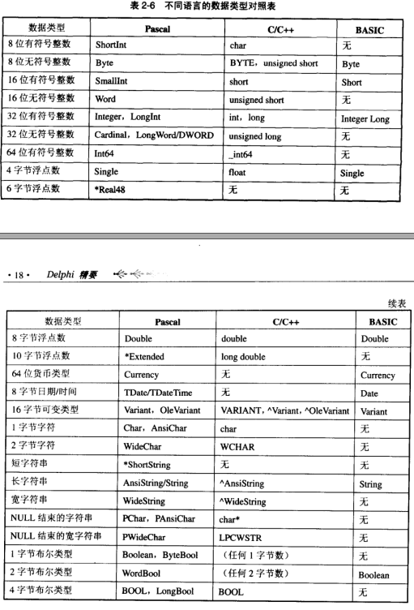

# 数据类型及其相互关系

## 1.1数据类型概述 

| Simple |                   |                                                              |
| ------ | ----------------- | ------------------------------------------------------------ |
|        | Ordinal(有序类型) |                                                              |
|        |                   | Integer(integer, Cardinal（无符号32位）, Shortint, Smallint……) |
|        |                   | Character(char, AnsiChar, WideChar)                          |
|        |                   | Boolean(Boolean, ByteBool, WordBool, LongBool)               |
|        |                   | Enumerated                                                   |
|        |                   | Subrange                                                     |
|        | Real              |                                                              |
|        |                   | Real                                                         |
|        |                   | Single                                                       |
|        |                   | Double                                                       |
|        |                   | Extended                                                     |
|        |                   |                                                              |
|        |                   |                                                              |
|        |                   |                                                              |
|        |                   |                                                              |



在delphi中一般使用单字节来存储字符，而widestring使用2个字节来存储字符。

使用短字符串，采用**String[MaxLength]** 的方法来定义，而不是用ShortString。

**PChar** 不是Pascal 标准的数据类型，**PChar** 声明一个以空字符串（Null）结尾的字符串的指针。

PChar可以像String一样使用。

一个指针占用**4** 个字节的空间，或者说，一个指针就是**4** 个字节大小的内存块。

每个类的类名称是自己的**ClassName** 属性，查看自己的类名称的方法

```pascal
procedure TForm1.Button1Click(Sender: TObject);
type
  PObject = ^TObject;
var
  PObj: PObject;
begin
  PObj := @Self;
  ShowMessage(PObj^.ClassName);
end;
```

6. Procedural(过程)类型

   **OnClick** 是一个事件，事件其实是一种特殊的属性。下面是这种属性的定义。

   ```pascal
   property OnClick: TNotifyEvent
   ```

   也就是说，OnClick 是**TNotifyEvent** 类型的属性,**TNotifyEvent** 的定义如下：

   ```pascal
   type TNotifyEvent = procedure(Sender: TObject) of object;
   ```

   因为有**of object** 关键字，所以**TNotifyEvent** 是对象的方法
   
   实际上，有**of object** 的过程除了指向过程地址的指针外，还有一个附带的指针——指向所属的对象。因此，普通的过程类型不能和有**of object** 的过程类型相互赋值。
   
7. Variant(可变)类型

   关于Variant我们需要理解一下几点：

   （1）**Variant** 可以存储绝大部分不同的数据类型，但是指针类型数据只能用**PVariant** 来存储。

   （2）**Variant** 变量在某时刻有三个可能的状态，**Unassigned** 表示没有值，可以用VarIsEmpty来测试。**Null** 值，可以用VarIsNull测试，和非Null值。声明一个**Variant** 变量后，他被置为**Unassigned** 状态。

   （3）可以使用VarType来判断**Variant** 变量来判断存储数据的实际类型。VarType返回一个Word类型数据，System单元中定义了一些常数来代表这个返回值，如varEmpty，varNull，varInteger等。

   **Variant** 的扩展类型**OleVariant** 。**Variant** 类型的数据只能在同一个应用中传递，当需要在不用应用程序、不同计算机间传送**Variant** 数据的时候，需要使用**OleVariant** 。

8. 类型别名

   （1）

   ```pascal
   type
     DWORD = LongWord;
   ```

   （2）

   ```pascal
   type
     HWND = type LongWord;
   ```

   以上就是定义类型别名的两种方法。

   第一种类型在任何时候在DWORD和LongWord都是兼容的，因为他们实际是上同样的类型，只是名字不同而已。

   第二种方法定义一个LongWord类型的新别名HWND，这个时候他们HWND和LongWord是两个完全不同的类型，在简单赋值的时候，编译器认为两个是兼容的，但是在用于var和Out参数等要求类型严格匹配的时候，则被认为不兼容。

   ## 1.2 变量的内存分配和释放

   函数或者过程内部定义的变量为局部变量；其他的变量被声明在interface和implementation部分称为全局变量。

   如果变量时非指针类型的，则声明后被自动分配内存。如果是全局变量，还会被初始化为0。

   指针类型的变量不会自动分配内存，如果是全局的指针会初始化值为nil，表示还没有指向的。

   无论是全局变量还是局部变量，非指针类型的变量时被自动分配的，这个工作由编译器编译时完成，所以这种分配方式成为静态分配。在静态分配时，全局变量的内存分配在全局变量区，局部变量分配在应用程序栈（**Stack** ）。他们的内存释放工作也被自动管理。

   应用程序可用的内存区分为三类，全局变量区（专门用来存放全局变量）、栈（Stack）和堆（Heap）。应用程序开始运行时，所有全局变量的内存被分配到全局变量区，应用程序结束时被释放，被分配到栈上的变量内存呗栈管理器自动释放，堆上的变量内存必须人工释放。

   1. 指针类型分配内存的方法

      ```pascal
      var
        P1, P2: PChar
      begin
        P1 := 'liliangwei';
        P2 := P1;
      end;
      ```

   2. 类类型，调用构造函数分配内存

      ```pascal
      var
        Obj: TObject;
      begin
        Obj := TObject.Create;{调用构造函数创建对象，变量Obj指向该对象}
        Obj.Free;{释放内存，Free内部调用析构函数Destroy；也可以使用             FreeAndNil(Obj);}
      end;
      ```

      对象变量指向的内存必须人工释放，因为这块内存被分配到堆而不是栈上。

   3. 分配指定大小的内存块。主要用于创建缓冲区，一些函数和过程通过缓冲区返回一些执行结果。比如文件读写，流读写以及大量的API函数。下面是一个API函数使用缓冲区的例子，该函数可以获得计算机名字。

      ```pascal
      var
        P: PChar;
        Size: Cardinal;
      begin
        Size := MAX_COMPUTERNAME_LENGTH + 1;
        GetMem(P, Size);{分配Size个字节的内存块(即缓冲区)，并让P指向它}
        GetComputerName(P, Size);{API函数GetComputerName将取得的计算机名放在P中}}
        ShowMessage(P);
        FreeMen(P);{释放缓冲区占用内存}
end;
      ```
   
      动态分配内存的函数，他们都是在堆中分配内存，所以必须释放：
      
      ```pascal
      procedure GetMem(var P: Pointer; Size: Integer);
      ```
      
      分配Size字节的内存块，并让P指向它。
      
      ```pascal
      function AllocMem(Size: Cardinal): Pointer;
      ```
      
      分配大小为Size字节的内存块并初始化为零，并返回地址指针。
      
      如果希望在中途改变先前使用GetMEM或者AllocMem分配的内存大小，可以使用ReallocMen：
      
      ```pascal
      procedure ReallocMem(var P: Pointer; Size: Integer);
      ```
      
      使用GetMem和AllocMem分配的内存都应该用FreeMem释放：
      
      ```pascal
      procedure FreeMem(var P: Pointer);
      ```
      
      用New分配的内存块大小由参数P的类型确定，因此，不要使用它给无类型指针（即Pointer类型）变量分配内存，释放该内存块时使用Dispose：
      
      ```pascal
      procedure Dispose(var P: Pointer);
      ```
      
   
   ## 1.3 内存数据结构
   
   1. String变量实际上是一个指针，指向第一个字符所在位置。
   
   2. String类型包含4个域
   
      偏移/Byte         内容
   
      -8                      存储计数引用
   
      -4                      存储字符长度
   
      0..Length - 1     存储实际字符
   
      Length               零字符（NULL或者#0）
   
   3. ANSIString和WideString使用4个Byte（即32Bits）来存储字符长度，而32Bits所能表示的最大整数是21亿，多以最大字符长度位2GB。
   
   4. Variant内部存储为TVarDate类型的记录。TVarData被定义在System单元。该记录主要包括两个字段
   
      （1）VType（TVarType类型），它用来存储数据类型。
   
      （2）另一个字段为8字节大小，用来存储实际数据或者指向该实际数据的指针
   
   ## 1.4 强数据类型和类型转化
   
   1. typecasting（类型强制转化）：typeIdentifier(expression)
   
      ```pascal
      var
        B: Boolean;
      begin
        B := Boolean(1);
      end;
      ```
   
      对于对象和接口，除了使用typeIdentitier外，还可以使用as操作符进行转化，在使用as前应该首先判断源对象和结构类型是否兼容、源对象/原接口是否支持结果接口，可分别使用is操作符和Support函数来做这种判断。
   
   2. variant parts in records（变体记录）
   
      定义如下
   
      ```pascal
      type recordTypeName = record
        fieldList1: type1;
        ……
        fieldListn: typen;
      case tag: ordinalType of
        constantList1: (variant1);
        ……
        constantListn: (variantn);
      end;
      ```
   
      其中case 到结尾部定义了多个变体字段。所有的变体字段共享一段内存，换句话说，如果对constangList1赋值，哪呢constantList2-constantListn也被赋了值。至于这些字段返回什么值，则是由他们的类型决定的。程序根据tag中的值决定应用constantList1-constantListn中的那个字段。例如：
   
      ```pascal
      type
        TDateConv = record
        case T: Boolean of
          True: (I: Byte);
          False: (B: Boolean);
        end;
        
        var
          D: TDataConv;
        begin
          D.I := 1;
        end;
      ```
   
   
   ## 1.5 过程和函数
   
   1. 当形参是指针类型和引用类型的区别。
   
      引用类型，形参和实参是同一个变量，因此能够实现完全的共享。
   
      指针类型，两个指针变量存储的是同一个地址，是两个变量。
   
      ```pascal
      procedure TForm1.ByVal(Obj: TObject)
      begin
        Obj := Button1;
        {改变形参指针指向，实参的指针指向不会改变，因为他们是两个变量}
      end;
      ```
   
      ```pascal
      procedure TForm1.ByRef();
      begin
        Obj := Button1;
        {改变形参指针指向，实参的指针指向会跟着改变，因为他们是同一个变量}
      end;
      ```
   
   2. 无类型参数
   
      声明时没有指定数据类型的参数成为无类型参数。
   
      无类型参数必须加const、out或var前缀；无类型参数不能指定默认值。  
   
   ## 1.6 声明指令
   
   1. 声明一个过程，可以使用register、pascal、cdecl、stdcall和safecall指令来指定参数传递顺序和参数内存管理方式，从而影响过程运作。如：
   
      ```pascal
      function MyFunction(X, Y: Integer): Integer; cdecl;
      ```
   
      | 指令     | 参数存放位置 | 参数传递顺序 | 参数内存管理 | 使用地点                                |
      | -------- | ------------ | ------------ | ------------ | --------------------------------------- |
      | register | CPU寄存器    | 从左到右     | 被调用者     | 默认。publlished属性存放方法必须使用    |
      | pascal   | 栈           | 从左到右     | 被调用者     | 向后兼容，不再使用                      |
      | cdecl    | 栈           | 从右到左     | 调用者       | 调用c/c++共享库                         |
      | stdcall  | 栈           | 从右到左     | 被调用者     | API调用，如回调函数                     |
      | safecall | 栈           | 从右到左     | 被调用者     | API调用，如回调函数。双接口方法必须使用 |
   
   ## 1.7 深入理解方法
   
   1. 从调用者的角度，可以分为普通方法和类方法。类方法在方法前面有class关键字
   
      ```pascal
      class procedure ClassProc
      ```
   
      构造方法也是一个类方法。
   
      类方法可以直接被类调用，就算对象没有被创建。对象也可以直接调用类方法。普通方法只能被对象调用。
   
      类方法是从C++的static函数借鉴来的。、
   
      实现一个类方法时，不要让他依赖任何实例信息，不要在类方法中存取字段、属性和普通方法。
   
   2. 从调用机制上，分为静态方法、虚方法和抽象方法。
   
      静态方法的定义方式：
   
      ```pascal
      TOneObject = class
        procedure OneProc;
      end;
      ```
   
      没有关键词修饰的方法被默认为静态方法。静态方法它的地址是编译时确定，运行时映射。
   
      虚方法的定义方式：
   
      ```pascal
      TOneObject = class
        procedure OneProc; virtual;
        function OneFun: boolean; dynamic
      ```
   
      虚方法使用virtual或者dynamic声明。
   
      虚方法可以在子类中覆盖，覆盖需要使用override关键字。
   
      ```pascal
      TParent = class
        procedure OneProc; virtual;
        function OneFun: boolean; dynamic;
      end;
      
      TChild = class(TParent)
        procedure OneProc; override;
        function OneFun: boolean; override;
      end;
      
      procedure TParent.OneProc;
      begin
        ShowMessage('TParent');
      end;
      
      function TParent.OneFun: boolean
      begin
        Result := false;
      end;
      
      procedure TChile.OneProc;
      begin
        inheriter;//inheriter调用父类的OneProc的代码，这句的结果显示'TParent'
        ShowMessage('TChild');
      end;
      
      function TChild.OneFun: boolean;
      begin
        Result := inherited OneFun;//调用父类的OneFun代码
        if not Result then
          Result := True;
      end;
      ```
   
      使用不同关键字声明的虚方法是有区别的。virtual声明的成为虚拟方法，dynamic声明的称为动态方法。
   
      抽象方法，是虚方法的特例，在虚方法声明后加上abstract关键字构成，如：
   
      ```pascal
      TParent = class
        procedure OneProc; virtual; abstract;
        function OneFun: boolean; dynamic; abstract;
      end;
      ```
   
      抽象方法和普通虚方法的区别：
   
      a. 抽象方法只有声明，没有实现。
   
      b. 抽象方法不许再之类中覆盖并实现后调用。因为没有实现的方法不能被分配实际地址，所以抽象方法可以被称为纯虚方法。
   
      如果一个类中含有抽象方法，那么这个类就成了抽象类。例如TStrings含有：
   
      ```pascal
      procedure Clear; virtual; abstract;
      procedure Delete(Index: Integer); virtual; abstract;
      ```
   
      等过个抽象方法。
   
      抽象类是不应该直接用来创建实例的，因为一旦调用了抽象方法，将抛出地址异常。
   
      因此，抽象类一般是中间类，实际使用的重视覆盖实现了抽象方法的子类。比如常用的字符串列表类TString，我们中使用他的子类而不是本身来构造实例，如：
   
      ```pascal
      var
        Strs: TStrings;
      begin
        Strs := TStringList.Create;
      end;
      ```
   
   3. 从用途来分：
   
      重载方法。用overload关键字来指明。
   
      ```pascal
      TParent = class
        procedure OneProc; overload;
        function OneProc(S: string): boolean; overload
      ```
   
      如果位于相同类中，都必须加上overload关键字，如果分别在父类和子类中，那么父类的方法可以不加overload而子类必须加overload。
   
      如果父类方法是虚的，那么在子类中重载该方法时应该加上reintroduce修饰字。
   
      ```pascal
      TParent = class
        procedure OneProc; virtual;
      end;
      
      TChild = class(TParent)
        procedure OneProc; reintrodure; overload;
      end;
      ```
   
      在published区不能出现多个相同的重载方法。例如：
   
      ```pascal
      TParent = class
        procedure OneProc; virtual;
      end;
      
      TChild = class(TParent)
      published
        procedure OneProc; reintroduce; overload;
        {和父类构成方法重载关系时可以的，因为在TChild的published区，只有一个OneProc方法，而在线面两行企图重载AntherProc则是没有可能的，编译器不允许在published区出现多个同名的方法}
        procedure AntherProc(S: String); overload;
        procedure AnotherProc; overload;
      end;
      ```
   
      published区的类成员会生成运行时类型信息，而类成员是通过名字区分的。因此，编译器无法为成员AnotherProc生成运行时类型信息。
   
      消息方法。消息方法的作用是截获并处理特定的一个消息。他使用的声明关键字是message。如：
   
      ```pascal
      TCustomForm = class(TScrollingWinControl)
      private
        procedure WMClose(var Message: TWMClose); message WM_CLOSE;
        ……
      end;
      ```
   
      WMClose的作用是捕获并处理消息WM_CLOSE。当WM_CLOSE消息到来时，方法WMClose被自动调用。
   
      消息方法的规则命名：消息类名大写 + '_' + 消息名（第一个字母大写，其余小写）；
   
      消息方法参数声明： var Message： 消息类型。消息类型可以是基本的TMessage，可以以是特定的消息类型。
   
      消息方法的实现类似下面的代码
      
      ```pascal
      procedure TCustomForm.WMClose(var Message: TWMClose);
      begin
        {在本类中对消息做必要的处理}
        Close；
        {然后调用父类对该消息的处理代码}
        inherited;
      end;
      ```
      
      
      
      ##  对象的克隆
      
      		1. 使用赋值运算符将一个对象引用赋值给一个对象变量；
        		2. 使用Assign或AssignTo方法可以将对象属性进行复制，得到两个状态相同的对象。
      
      第一种赋值操作
      
      ```pascal
      var
        a,b: TMyObject;
      begin
        a := TMyobject.create;
        b := a;
      end;
      ```
      
      如果写成下面这样，就会造成内存泄漏
      
      ```pascal
      var
        a, b: TMyObject;
      begin
        a := TMyObject.create;
        b := TMyObject.create;
        b := a; //错误，对象b丢失导致内存泄漏。
      end;
      ```
      
      如果要让对象b克隆对象a，则需要考虑第二种赋值方法
      
      ```pascal
      var
        a, b: TMyObject; //这里假设TMyObject时TPersistent的派生类
      begin
        a := TMyObject.create;
        b := TMyObject.create;
        b.Assign(a); //对象b的属性和内容和对象a完全相同
      end;
      ```
      
      **b := a** 意味这b是a的引用，即两者时同一对象。如果写成了b.Assign(a)，那么b是一个单独的对象，其状态与a相同，也就可以看成是b克隆了a。
   
   ## 对象的销毁
   
   在销毁对象的时候尽可能的使用**Free** 来销毁对象，为了确保对象即使发生异常也会正确的销毁，可以使用**try……finally** 异常句柄。
   
   ```pascal
   MyObj := TSomeClass.Create;
   try
     MyObj.DoSomething;
     MyObj.DoSomethingElse;
   finally
     MyObj.Free;
   end;
   ```
   
   ```pascal
   // 将十进制转换成十六进制字符串
   IntToHex(int Value; int Digits); // Vaule是要转换的值，Digits是字符串的位数
   ```
   
   ## 查看是否存在内存泄漏
   
   ```pascal
   
   ```
   
   ## Delphi中 New,Getmem,ReallocMem联系与区别
   
   ```pascal
    procedure New(var P: Pointer);  {为一个指针变量分配内存，会自动计算指针所指数据结构需要空的空间大小}
    procedure GetMem(var P: Pointer; Size: Integer); {分配一个指定大小的内存块（连续），并用P指向它}
    procedure ReallocMem(var P: Pointer; Size: Integer); {重新分配指定大小内存块，参数P必须是nil或者指向一个由GetMem, AllocMem, 或 ReallocMem分配的内存变量，其分配的内存是连续的，会把前面已有的数据移到新分配的内存中去}
   //通常采用New分配内存比较好。
   一、New和GetMem都可以为指针类型动态分配内存，并且Delphi不会对由此分配的内存进行管理，即必须有相应的代码对其进行释放，否则内存将“丢失”，直到应用程序结束。  
   二、New分配的内存必须由Dispose来释放；GetMem分配的内存必须由FreeMem来释放；  
   三、New根据指针类型来自动计算需要分配的内存尺寸；GetMem必须指定尺寸；
   因此，对于类型指针，一般用New和Dispose来进行管理；对于内存尺寸随机的指针（典型地如PChar），一般用GetMem和FreeMem来进行管理。从另一方面来说，在很多时候用哪一对例程都可以进行动态内存管理。
   ```

   


