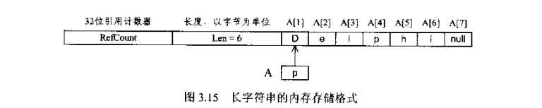
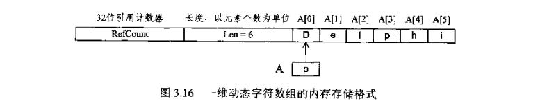
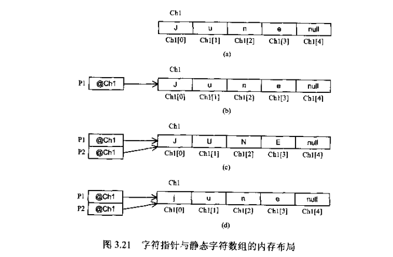

# delphi 字符串详解

## 短字符串和字符数组

```pascal
// 字符串数组的定义
var
  Str1, str2: array of [0..6] of AnsiChar; //在delphiXE中Char是双字节，这里使用AnsiChar是为了和书中保持一致。
// 为了解决字符串类型不丰富的问题，delphi中引入了字符串，其中有Shortstring，ANSIString， WideString。
// 为了与传统pascal字符串相兼容，ShortString使用紧缩格式。它最多只能容纳255个标准ASCII字符。
var
  str1, str2: string[7];
  
// 下面时字符数组和字符串的比较
var
  A: array[0..6] of AnsiChar;
  B: String[7];
begin
  A := 'Delphi7';
  B := 'Delphi7';
end;
```

|      | A[0] | A[1] | A[2] | A[3] | A[4] | A[5] | A[6] | A[7] |
| :--: | :--: | :--: | :--: | :--: | :--: | :--: | :--: | :--: |
|  A   |  D   |  e   |  l   |  p   |  h   |  i   |  7   |      |
|  B   |  7   |  D   |  e   |  l   |  p   |  h   |  i   |  7   |

```pascal
  ShowMessage('a Sizeof' + IntToStr(SizeOf(a))); // 7
  ShowMessage('b Sizeof' + IntToStr(SizeOf(b))); // 8
  ShowMessage('a Length' + IntToStr(Length(a))); // 7
  ShowMessage('b Length' + IntToStr(Length(b))); // 7
  ShowMessage('a Low' + IntToStr(Low(a))); // 0
  ShowMessage('b Low' + IntToStr(Low(b))); // 0
  ShowMessage('a High' + IntToStr(High(a))); // 6
  ShowMessage('b High' + IntToStr(High(b))); // 7
  // 字符数组和字符串并不兼容。
```

## 字符串

* 这里讨论长字符串（AnisString）和宽字符串（WideString）， 在delphi中默认情况下string类型就是AnsiString类型。

* ANSIstring采用非紧缩格式。ANSIstring字符串可以在使用是动态分配内存。(这个东西不是字符串常量)

* 当我们声明了长字符串变量，实际上分配了32位（4字节）的内存空间存储一个指针，该指针指向存储实际字符串的内存地址。

* 当字符串变量为空时，此指针值为nil，字符串内容本身不需占用额外的存储空间。当字符串非空时，此指针为动态分配的内存块的首地址，该内存块存储了相应的字符串内容（包括字符串值，一个32位（4字节）的长度指示符和一个32位的引用计数器）

* 存储字符串是在堆中分配的。

* 因为长字符串变量为隐式指针，因为多个长字符串变量可以指向相同的内容而不需要存储字符串的多个副本。只要一个长字符串变量被释放或赋予了新值，则原字符串的引用计数自动减1，而新字符串（如果存在）的引用计数自动递增1。如果某个长字符串的引用计数递减到0，则其占用的内存被释放。当改变长字符串时，而且仅当引用计数器大于1时才生成该字符串的一个副本，此即为生存期管理 的写时复制（copy-on-write）语义。

* 从本质上说，AnsiString类型与一维动态字符数组类似，他们的主要差别在于

  1. 虽然使用相同的引用计数技术，但AnsiString类型与一维动态字符数组的索引方式不同。

  ```pascal
  var
    A: string;
    B: AnsiChar;
    N: integer;
  begin
    SetLength(A, 6);
    A := 'Delphi';
    B := A[0]; // 错误，不能访问A[0]
    N := Length(A); // N = 6
    B := A[1]; // B := 'D';
    N := SizeOf(A); // N = 4, 返回A的内存大小，而不是字符串本身占用的内存大小
  end;
  ```
2. A的内容（p值）实际为A[1]的地址。32位引用计数、字符串长度以及最后的A[7]都是由Delphi自动维护的。程序不能进行操作。AnsiString类型变量的索引下标从1到长度值。字符串在尾部添加一个Null字符（这个字符其实是#0，不是真正意义上的Null，真正意义上了Null表示空，C语言的字符串是以'\0'为结尾的，'\0'就是#0）是为了与C语言null结尾的字符串相兼容。所以可以将长字符串赋值给某个null结尾的字符串变量。

  

  3. 一维动态数组存储字符串时，其分配机制有些差异，但是正是这些差异使得我们创建的数据类型不同。

  ```pascal
  var
    A: array of Char;
    B: Char;
    N: integer;
  begin
    SetLength(A, 5);
    A[0] := 'D';
    A[1] := 'e';
    A[2] := 'l';
    A[3] := 'p';
    A[4] := 'h';
    A[5] := 'i';
    A := 'Delphi'; // 错误，不能将字符串类型赋值给一维动态数组
    B ：= A[0];  // 正确，A[0] = 'D';
    N := Length(A); // N = 5;
    N := Sizeof(A); // N = 4, 返回A的内存大小，而不是字符串本身所占内存大小
  end;
  ```

  4. A的内容（p值）实际为A[0]的地址。

  

## 字符指针

* PChar类型与字符串常量

  1. PChar类型与字符串常量是赋值兼容的，也就是说我们可以使用赋值语句将一个字符串常量赋给PChar或PWideChar类型的变量。

  ```pascal
  var
    P: Char;
  begin
    P := 'Hello World';
  end;
  ```

  2. 此时，P为指向null结尾字符数组的指针。执行上述语句后，编译器将把"Hello, World!"复制到P所指向的内存区中并自动在结尾出添加一个null字符，即形成以null结尾的字符串。因此，上面的程序段等价与

  ```pascal
  const TmpStr: array[0..12] of Char = 'Hello World!'#0;
  var
    P: PChar;
  begin
    P := @TmpStr;
  end;
  ```

  3. 字符串常量也可以作为实际参数传递给子程序中PChar或PWideChar类型的形式参数。但形式参数必须为常量参数或值参数。

  ```pascal
  function StrUpper(Str: PChar): PChar;
  
  procedure ButtonClick(Sender: TObject);
  begin
    Canvas.TextOut(X, Y, String(StrUpper('Hello World!')));
  end;
  ```

  4. 也可以使用PChar或PWideChar类型声明类型常量

  ```pascal
  const
    Message: PChar = 'Program';
    Digits: array[0..2] of PChar = ('Zero', 'One', 'Two');
  ```

* PChar与字符数组

  1. 可以使用静态字符数组创建以null结尾的字符串，并将它赋给PChar的指针变量。用静态字符数组创建以null结尾的字符串时，索引下标应该从0开始，在给数组赋值时，字符串中字符的数目至少要比数组长度小1（需要保留一个位置存储null字符）。

  ```pascal
  var
    Ch: array[0..4] of char;
    P: PChar;
  begin
    Ch := 'June';
    P := Ch;
  end;
  ```

  2. PChar类型兼容于从索引下标0开始的静态字符数组，既可以将索引下标从0开始的静态字符数组赋给PChar类型的指针变量。此过程不可逆，即不能将PChar类型的指针变量赋给索引下标从0开始的静态字符数组。

  ```pascal
  label 1, 2, 3, 4, 5;
  var
    Ch1, Ch2: array[0..4] of Char;
    P1, P2: PChar;
  begin
    1: Ch1 := 'June';  // 正确
    2: P1 := Ch1; // 正确
    3: P2 := StrUpper(Ch1); // 正确
    4: P2 := StrLower(P1); // 正确
    5: Ch2 := P1; // 错误，静态字符数组不兼容PChar；
    ShowMessage(IntToHex(Integer(@Ch1), 8)); // 0018F536
    ShowMessage(IntToHex(Integer(P1), 8)); // 0018F536
    ShowMessage(IntToHex(Integer(P2), 8)); // 0018F536
  end;
  ```

  

  3. PChar类型的字符串可以像数组一样使用下标来获得字符串中的字符。如果在d中，P1[2]则返回'j'，P2[1]则返回'u'。
  4. 可以使用“+”、“-”操作符进行PChar指针类型的加减运算，就像上面那样

  ```pascal
  P1 := 'june';
  IntToHex(Integer(P1), 8); // 返回0018F536
  ```

  对于PChar类型，指针加1，所指向地址下移一个字节（8位）；对于PWideChar类型，指针加1，下移两个字节。

