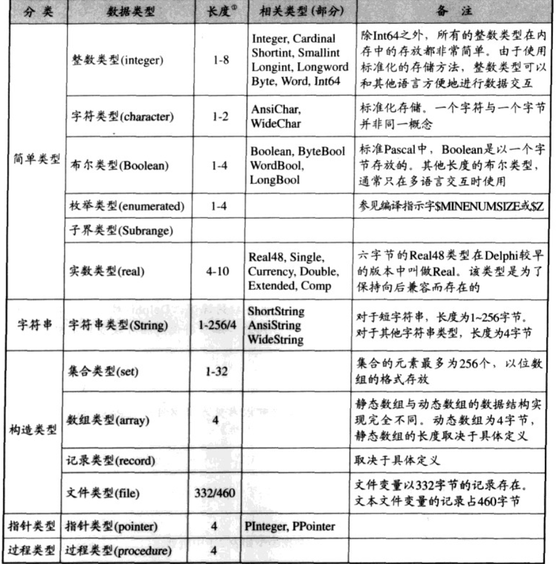

# 源代码分析

## 第一章 最小化内核

* 废话不多说，先把源码贴上来

```pascal
//系统内核单元
unit System;

interface

procedure _InitExe;           // 程序的入口
procedure _HandleFinally;     // 异常处理
procedure _Halt0;             // 程序的出口

const
  Kernel32 = 'kernel32.dll';
  User32 = 'user32.dll';

type
  TGUID = record              // Com支持
    D1: LongWord;
    D2: Word;
    D3: Word;
    D4: array[0..7] of Byte;
  end;

implementation

procedure ExitProcess (uExitCode: LongWord); stdcall;
  external kernel32 name 'ExitProcess';

procedure _InitExe;
asm
end;

procedure _HandleFinally;
asm
end;

procedure _Halt0;
begin
  ExitProcess(0);
end;

end.
```

```pascal
//系统初始化单元
unit SysInit;

interface

var
  TlsIndex: Integer = -1;
  TlsLast: Byte;

const
  PtrToNil: Pointer = nil;

implementation

end.
```

* 主程序

```pascal
//示例程序。目标文件为3584 Bytes
program MiniDExe;

uses
  SysInit in 'sys\SysInit.pas',
  system in 'sys\system.pas';

function ShowMessageBox(hWnd: LongWord; lpText, lpCaption: PChar; uType: LongWord): Integer;
  stdcall; external user32 name 'MessageBoxA';

const
  MB_ICONINFORMATION = $00000040;

begin
  ShowMessageBox(0, 'Written in pure Delphi!', 'Hello World!', MB_ICONINFORMATION);
end.
```

* 为什么要研究最小化内核？这个内核已经不能在精简了，但是如果要了从源代码一级分析delphi是如何将对象，组件库，接口等框架技术包裹在应用程序之上的，那么从一个最简化内核分析再简单不过了。

## 第二章 基本数据类型的实现

* 深入了解delphi各种数据类型的实现，是分析delphi源代码的第一步，其中最重要的两点是

  1. 数据类型的内存占用和内存布局
  2. 强制类型转换

### 基本数据类型

  

* 这里的长度仅指参考长度（字节），在代码中可以使用sizeof()来获得。

### 变量与常量

* 根据变量在源代码中定义的位置，可以分为全局变量和局部变量，在一个例子中获取全局变量和局部变量的地址（下面是自己的结果）

```pascal
Globl Var 1 : 00417E78
Globl Var 2 : 00417E7C
Local Var 1 : 0018FF58
Local Var 2 : 0018FF54
```

* 根据上面的结果可以得出两个结论，1是全局变量和局部变量存放的位置不同，2是全局变量的地址是递增的，局部的是递减的。
* 全局变量在引用程序的数据区分配，局部变量在栈中分配。