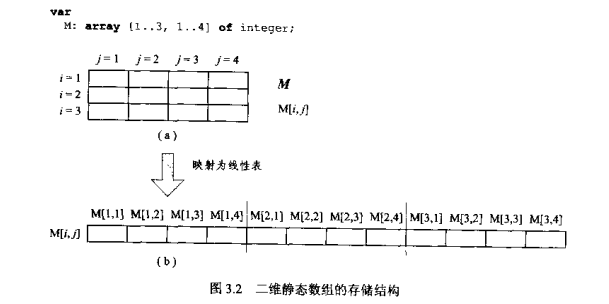

# 第一章 Object Pascal 语言精义

## 对指针的理解

```pascal
// 指针变量，首先是一个变量，它里面存的是一个地址。
// 它的使用和普通变量类似，例如
iVar: Integer;
iVar := 1;
// 当使用iVar这个变量的时候，这个变量就是1。
iVar := iVar + 1;  // iVar = 2;

//指针变量类似,
Ptr: Pointer;
Ptr := @iVar;
// 这里Ptr中存的就是iVar的地址。当使用这个变量的时候，获得的就是iVar的地址。
sVar: string;
sVar := IntToHex(Integer(Ptr), 8); // sVar的值是005221E8

// 过程类型的变量是一种特殊的变量，过程类型的变量是一个指向过程或函数地址的指针变量，而把过程类型变量使用解释为对该过程或函数地址的引用。
```


# 第三章 数据组织

## 3-1 数据的组织结构

### 3-1-1 同质数据

* 某些数据结构保存的数据性质完全相同的数据

* 一维静态数组，就是普通数组。

  普通数组相同大小，类型 可以直接相互赋值

  ```pascal
  var
    A, B: array[1..10] of Integer;
    i: Integer;
  begin
    for i := 1 to 10 do
    begin
      A[i] := i;
    end;
    B := A;  // 数组直接赋值
  end;
  ```

* 标准函数Low和High返回一维数组索引下标的上界和下界的序数，标准函数Length返回数组的元素个数。

* 二维静态数组，二维数组中第一个元素值指的是列。

  ```pascal
  var
    M: array [1..3, 1..4] of Integer;
    i, j: Integer;
  begin
    for i := 1 to 3 do
      for j := 1 to 4 do
        A[i, j] := 4 * (i - 1) + j;
  end;
  ```

  

* 因为内存是线性的，所以矩阵在内存中也是线性存储的。将二维数据转换成一维线性表存储是，Delphi总是一行一行来存储。如果M的首地址为p，元素个数为m * n，每个元素占用4个字节，那么元素M[i, j]的地址为

  ```pascal
  p + 4(n(i - 1) + j - 1) // m[i, j] 的地址
  ```

  

  

* 类似的，将三维数据转化成一维线性表是，delphi规定，总是先存储数组最后一维数据，然后才依次存储第二维，第一维的数据。

  

* 多维数组的结构：

  1. 整体上时分为最后一维的数量，然后在每个部分整体分为次一维的数量，然后依次类推。

  假设三维数组M的首地址为p，元素个数为m * n * q。每个元素占用4个字节，那么元素M[i, j, k] 的地址为

  ```c
  p + 4(nq(i - 1) + q(j - 1) + k - 1) // m[i, j, k]的地址
  ```

* 对于多维数组，标准函数Length、Low和High任然有效。如果将这三个函数直接应用与数组变量名，则Length返回的是第一维的长度，Low返回第一维下标的下界，High返回第一维下标的上界。

* 短字符串和字符数组（详细间Delphi中字符串详解）

* 

# 第四章 程序抽象

## 4-4 算法抽象

### 4-4-2 过程类型

​		在Object Pascal中，函数名至少出现两次，一次是定义，一次是调用。编译器在编译这两次函数名时，使用不同的规范，出现在function后的过程或函数名将解释为程序代码的首地址，而出现在其他位置的过程或函数名将解释为对该地址的引用。

​		当声明和使用过程类型时，为保持过程类型变量与过程或函数名的一致性，编译器将把过程类型变量的声明解释为一个指向过程或函数地址的指针变量，而把过程类型变量使用解释为对该过程或函数地址的引用。

* **引用：按照C/C++的语义，引用就是指针，但操作时却不需要使用指针运算符。之所以可以使用引用，时因为引用相当于某个变量或值的别名，它没有引入任何新的存储对象，对引用的操作将直接由编译器映射到该变量或值**


# 第十六章 类引用

* 类引用类型的一个重要的用途就是指导复杂类构造。

* 一个祖先类的引用类型可以在继承类中作为域和属性的类型，也可以作为方法的参数类型，作为方法的参数类型时多用于构造器的定义。

  ```pascal
  type
    TColloectionItemClass = class of TCollectionItem;
    TCollection = class(TPersistent)
    private
    	//域定义为类引用类型
    	FItemClass: TCollectionItemClass;
    	FItems: TList;
    public
      // 构造器的参数使用类引用类型
      constructor Create(ItemClass: TCollectionItemClass);
      // 属性定义为类引用类型
      property ItemClass: TCollectionItemClass read FItemClass;
    end;
   
  constructor Create(ItemClass: TCollectionItemClass);
  begin
    FItemClass := ItemClass;
    FItems := TList.Create; // 创建另一个类的实例
    NotifyDesigner(Self, Self, opInsert);
  end;
  ```

## 16-2-2 Application 对象与窗体创建

* 我们知道，窗体对象是在delphi中自动生成的应用工程文件中通过下面的语句创建的

  ```pascal
  Application.CreateForm(TForm, Form1)
  ```

* Application是delphi自动创建的运行类TApplication的对象实例，delphi创建的应用程序都有Application对象。该类的CreateForm方法的原型为

  ```pascal
  procedure CreateForm(InstanceClass: TComponentClass; var Reference);
  ```


# 第十七章 属性与事件

​		从本质上说，属性对应着某种访问和存储对象内部数据的机制，它可以在不破坏类声明的访问控制（保护机制）的情况下提供一种灵活的访问和存储对象数据的手段；而事件则相当于指向某个方法的属性，它构成了面向组件开发的基础。

## 17-1-3 属性的存储说明

* 一般的，属性的声明中存储说明的形式为

  ```pascal
  <stroed False/True> <default 属性缺省值>/<nodefault>
  ```

  其中stored指示符用于说明published属性值是否存储到窗体文件中；default指示符用于说明当前属性值是否需要流入流出窗体文件；nodefault指示符用于说明属性必须流入流出。这三种说明都是可选的。

* 注意事项

  1. 当某个属性值说明为stored时，指示符后面只能取False或True值。

     ```pascal
     published
       property Year: integer read FYear write SetYear stored False;
       property Days: integer read GetDays write SetDays stored IsLeapYe;
       // IsLeapYe 是一个返回值为Boolean类型的函数
     ```

  2. 当某个属性通过stored指示符说明为True时，窗体文件将储存该属性值。当打开窗体文件时可以见到该属性；反之，窗体文件不保存该属性。如果声明时未通过stored指定存储形式，则缺省为True。由于stroed属性说明仅用于说明窗体文件是否保存该属性，所以只有属性为published属性时，才可以进行存储说明。
  
  3. 当用default说明属性的流入流出条件时，default指令符后面的属性值的类型必须与属性的类型相同。例如
  
     ```pascal
     property Year: integer read FYear write SetYear default 2001;
     ```
  
     default说明并不是属性的缺省值，它仅影响属性的流入流出操作。即在stored为True的情况下，只要属性不为后面的值就必须进行流入流出操作。
  
  4. 如果祖先类声明了带缺省值的属性，而后代要覆盖它，则如果不指明新缺省值，应使用nodefault进行说明。
  
     ```pascal
     type
       TJuControl = class(TControl)
       protected
         property Tag: Longint read FTag write FTag default 0;
       end;
       
     TJuSubControl = class(TJuControl)
     public
       property Tag nodefault;
     end;
     ```
  
  5. 当用default或nodefault对属性进行说明时，属性只能为叙述类型或集合类型。当属性为real，指针或string类型且没有声明缺省值时，默认值为0， nil和空字符串。
  
  6. GetYear函数方法的声明必然是：
  
     ```pascal
     function GetYear(): integer;
     ```
  
     SetYear过程的声明必然是
  
     ```pascal
     procedure SetYear(AYear: integer);
     ```
  
     或
  
     ```pascal
     procedure SetYear(const AYear: integer);
     ```
  
     

## 17-2 属性的类型

​		属性可以声明没有***对应域***的属性，但是不可以声明***没有类型***的属性

### 17-2-4 对象类型的属性

* 对象类型属性的Get方法直接使用域，而Set方法不能使用域。例如在VCL中的TShape类声明：

  ```pascal
  type
    TShape = class(TGraphicControl);
    private
      FPen: TPen;
      FBrush: TBrush;
      procedure SetBrush(Value: TBrush);
      procedure SetPen(value: TPen);
    public
      constructor Create(AOwner: TComponent); override;
      destructor Destroy; override;
    published
      property Brush: TBrush read FBrush write SetBrush;
      property Pen: TPen read FPen write SetPen;
    end;
  ```

  按照一般原则，一个类（TShape）中所包含的所有类（TPen与TBrush）的构造和析构应该在该类的构造和析构方法中进行：

  ```pascal
  constructor TShape.Create(AOwner: TComponent);
  begin
    inherited Create(AOwner);
    FPen := TPen.Create;
    FBrush := TBrush.Create;
  end;
  
  destructor TShape.Destroy
  begin
    FPen.Free;
    FBursh.Free;
    inherited Destroy;
  end;
  ```
```pascal
  
  这个就导致了一个问题，即在设置属性时，既不能直接将FPen与FBrush指向Value 参数指向的对象实例，也不能构造新的FPen与FBrush对象实例，只能调用该类的Assign方法进行对象内容的复制。这表明，只有那些由TPersistent类派生的类才可以作为类的对象属性，故而对象属性的Set方法典型形式为：
  
  procedure TShape.SetBrush(Value: TBrush);
  begin
    FBrush.Assign(Value);
  end;
  
  procedure TShape.SetPen(Value: TPen);
  begin
    FPen.Assign(Value);
  end;
```

  ***也就是说，如果一个类中要实现对象属性，那么这个类必须是TPersistent 的子类，这个类必须直接或间接从TPersistent这个类继承***。

同样的原因也解释了为什么对象属性的设置必须通过Set方法。假设TShape类的Pen属性定义为

  ```pascal
  property Pen: TPen read FPen write FPen;
  ```

  在进行属性赋值时会发生什么情况呢？FPen将指向新的对象实例，其原来的对象实例还是没有释放对象也没有得到访问。

### 17-2-5 数组类型的属性

​		数组属性的声明：

```pascal
property 属性名[参数表]：类型 read 方法名 write 方法名 <default>
```

​		参数类型可以是简单类型，例如整数和字符串类型，但是不能是记录类型和类类型。

```pascal
type
  TNames = array[0..9] of string;
  
  TJuComponent = class(TComponent)
  private
    FNames: TNames;
    function GetNames(const Index: integer): string;
    procedure SetNames(const Index: integer; const Name: string);
    function GetIndexs(const Name: string): integer;
    procedure SetIndexs(const Name: string; const Index: integer);
  public
    constructor Create(AOwner: TComponent); override;
    property Names[const Index: integer]: string read GetNames write SetNames;
    property Indexs[const Name: string]: integer read GetIndexs write SetIndexs;
  end;
  
  function TJuComponent.GetIndexs(const Name: string): integer;
  var
  	i: integer;
  begin
    Result := -1;
    i := -1;
    repeat 
      Inc(i);
    until (CompareStr(FName[i], Name) = 0) or (i = 10);
  	if i < 10 then
  	  Result := i;
  end;
  
  function TJuComponent.GetNames(const Index: integer): string;
  begin
  	Result := '';
  	if (Index >= 0 ) or (Index <= 9) then
  	  Result := FNames[index];
  end;
  
  procedure TJuComponent.SetNames(const Index: integer; const Name: string);
  begin
    if (Index in (0..9]) and (FNames[Index] <> Name) then
      FName[Index] := Name;
  end;
```

​		使用数组属性时注意事项

* 在声明数组属性时，访问说明中read或write后必须跟Get或Set方法名，出现域名是不允许的。

* Get方法的参数表的参数类型和顺序必须与属性参数表相同，Set方法的参数表中必须列出属性的参数表且该列表顺序与属性参数表必须相同，Set方法的最后一个参数为与属性类型相同的值或常数。

* 数组类型的属性可以使用下标进行访问。下面两句话是等价的

  ```pascal
  Memo.Lines.Add(FJuComp.Names[I]);
  Memo.Lines.Add(FJuComp.GetNames(I));
  ```

* 数组属性声明中不允许进行存储说明，但是可以使用default指示符，此时该指示符不是存储说明，二是指定当前属性为类中的缺省属性。例如

  ```pascal
  type
    TStringArray = class
    public
      property Strings[Index: integer]: string ....; default;
    end;
  ```

  此时default前面是有分号的。如果类中有多个属性，只能将一个属性指定为缺省属性。对于缺省数组属性，可以直接使用对象名来访问属性

  ```pascal
  var
    Str: TStringArray;
  begin
    Str[1] := 'Delphi';
  end;
  ```

* 数组属性必须有自己的属性编辑器，对象检查器不能自动编辑此类属性，另外，一般不能将数组属性声明为published

## 17-4 方法指针与事件

​		事实上，方法指针是一种特殊的过程类型：一般的过程类型是指向子程序的指针，所以该指针只需要保存该过程或函数的内存地址即可（这需要4个字节的存储空间）；而方法指针是指向某个类的某个方法的指针，它用来引用类的方法，因此需要保存两个地址，一个是方法的地址，一个是该方法所属对象的地址（这需要8个字节的存储空间）。

​		这表明，方法指针是带有Self参数的过程类型。正是由于这个差别，一般的过程类型与方法过程类型不兼容。

​		在形式上，与一般过程类型不同，方法指针类型要带有 of object 关键字。

```pascal
type
  TNotifyEvent = procedure (Sender: TObject) of object;
```

# 第 18 章       运行时类型信息

​		所谓运行时类型信息是指在运行时保存和检索对象和数据类型信息的手段。

## 18-2   获取持久类RTTI


